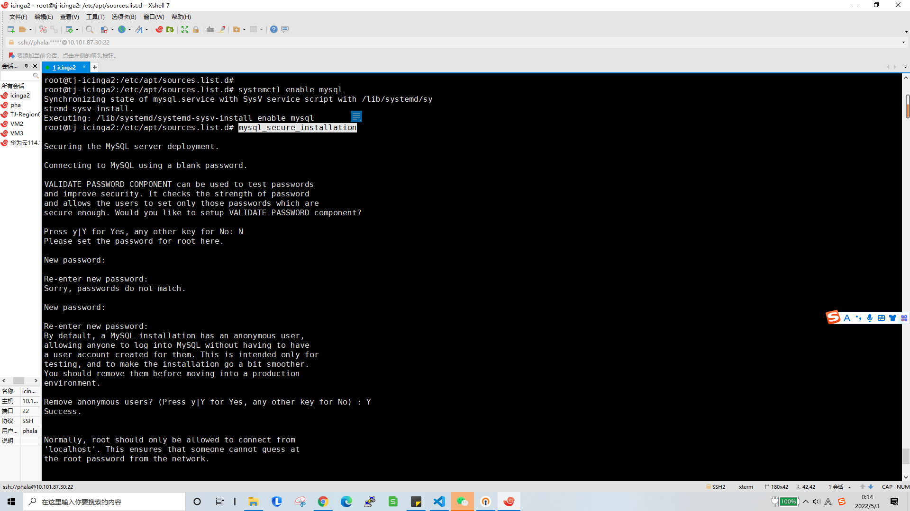
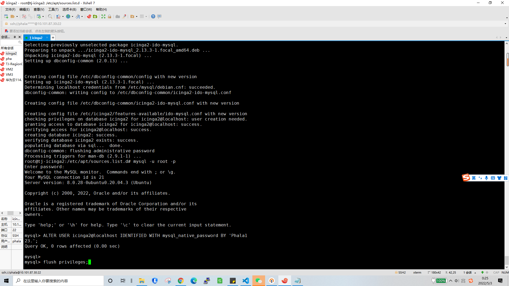

# Monitoring
 alarms with miner in unexpection state or broken

## Requiesrments
Install Icinga2 with Mysql and web modules, e.g. with:
https://www.howtoforge.com/how-to-install-icinga-2-monitoring-on-ubuntu-20-04/    

_warning :You can follow the steps below, but ensure that each step is complete without error before proceeding to the next step!_  
1.  
curl https://packages.icinga.com/icinga.key | apt-key add -  
cd /etc/apt/sources.list.d/  
vim icinga-focal.list  
2.add and save:  
deb http://packages.icinga.com/ubuntu icinga-focal main
deb-src http://packages.icinga.com/ubuntu icinga-focal main  
3.  
sudo apt update  
sudo apt install icinga2 monitoring-plugins  
systemctl start icinga2  
systemctl enable icinga2  
sudo apt install mysql-server mysql-client   
systemctl start mysql  
systemctl enable mysql  
4.
mysql_secure_installation  
  

5.  
sudo apt install icinga2-ido-mysql  (choose yes,yes,and set icinga2-ido-passwd)  
mysql -u root -p  
6.  
ALTER USER icinga2@localhost IDENTIFIED WITH mysql_native_password BY 'setpasswd';
flush privileges;  
exit
  
7.  
icinga2 feature enable ido-mysql  
icinga2 feature list

## generate templete
generate miners template with all workers:

./genconf2 > /etc/icinga2/conf.d/miners.conf

## add CRon

in file /etc/cron.d/monitoring

* * * * *       root    /etc/icinga2/scripts/collect-api-data

1111111111111  
22222222222222222