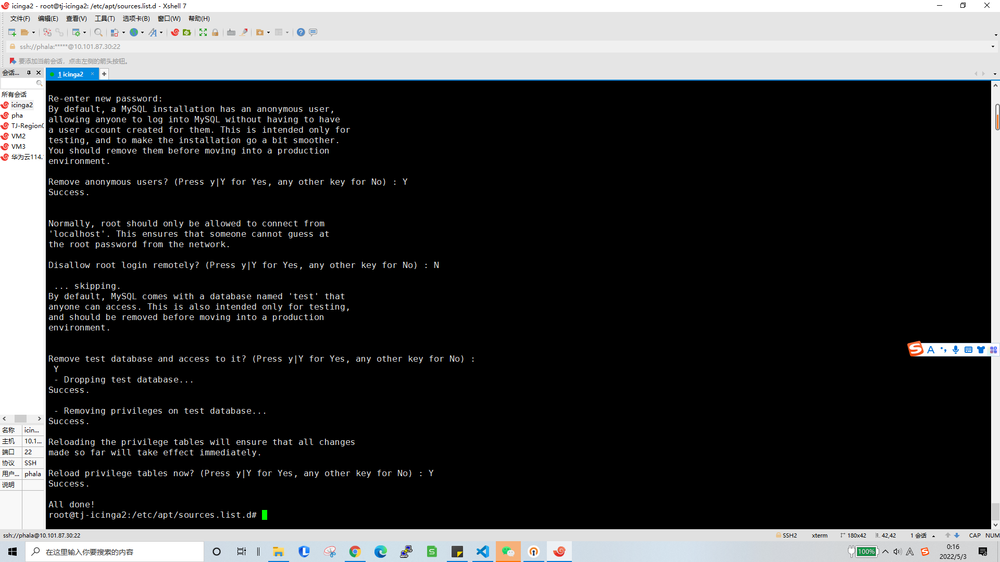
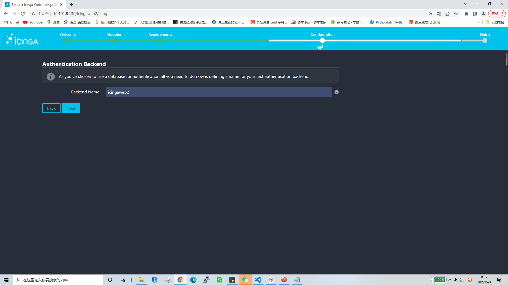

# Monitoring
 alarms with miner in unexpection state or broken

## Requiesrments
Install Icinga2 with Mysql and web modules, e.g. with:
https://www.howtoforge.com/how-to-install-icinga-2-monitoring-on-ubuntu-20-04/    

_warning :  
1.Setup a new ubuntu20.04 system to setup lcinga2    
2.You can follow the steps below, but ensure that each step is complete without error before proceeding to the next step!_  
start:  
sudo su  
1.  
sudo apt update  
sudo apt upgrade  
curl https://packages.icinga.com/icinga.key | apt-key add -  
cd /etc/apt/sources.list.d/  
vim icinga-focal.list  
2.  
(add and save: )   
deb http://packages.icinga.com/ubuntu icinga-focal main  
deb-src http://packages.icinga.com/ubuntu icinga-focal main  
3.  
sudo apt update  
sudo apt install icinga2 monitoring-plugins  
systemctl start icinga2  
systemctl enable icinga2  
sudo apt install mysql-server mysql-client   
systemctl start mysql  
systemctl enable mysql  
4.  
mysql_secure_installation   
  

5.  
sudo apt install icinga2-ido-mysql  (choose yes,yes,and set icinga2-ido-passwd)  
mysql -u root -p  
6.  
ALTER USER icinga2@localhost IDENTIFIED WITH mysql_native_password BY 'setpasswd';  
flush privileges;  
exit  
  
7.  
icinga2 feature enable ido-mysql  
icinga2 feature list

8.  
systemctl restart icinga2  
sudo apt install python3-software-properties  
sudo add-apt-repository ppa:ondrej/php (Remember to press enter )  
9.  
sudo apt install apache2 php7.3 php7.3-common php7.3-gd php7.3-ldap php7.3-intl php7.3-curl libapache2-mod-php7.3 php7.3-mysql php7.3-pgsql php7.3-xml  
10.  
vim /etc/php/7.3/apache2/php.ini   (set date.timezone = Asia/ShangHai
,cgi.fix_pathinfo=0)

11.  
systemctl restart apache2  
systemctl enable apache2  
sudo apt install icingaweb2 icingacli  
icingacli setup token create (copy The newly generated setup token is: 9b871ead0a60c94f)  
12.  
mysql -u root -p  
create database icingaweb2;  
create user icingaweb2@localhost identified with mysql_native_password by "icingaweb2pass";  
grant all privileges on icingaweb2.* to icingaweb2@localhost with grant option;  
flush privileges;  
exit  
13.  
open http://your-IP/icingaweb2/setup and input setp 11 your copy result  
  
14.  
choose doc and monitroing  

15.  
Will see Two modules are missing 

16.  
next

17.  
config icingawb2 database (Except for the password you set in step 12, everything else is the same, remember to verify)

18.  
next  

19.  
Set your password for logging in to web pages  

20. 
next  

21.  
next  

22.  
next  

23.  
config icinga2 database(Except for the password you set in step 6, everything else is the same, remember to verify)

24. 
Transport Type set Local Command File

25. 
next  

26.  
next

27.  
icinga2 setup done!!!   
you can open http://your-IP/icingaweb2/authentication/login login

28.  
sudo su  
29.   
cd /root/  
sudo apt install git  
git clone https://github.com/PHA-SYSOPS/Monitoring.git  
cp ./Monitoring/all-generated-machines ./  
vim /root/all-generated-machines (add machines hostname)  
30.   
cd /root/Monitoring  
chmod 777  generate-host-template  
./generate-host-template > /etc/icinga2/conf.d/miners.conf  
cd scripts/  
chmod 777 collect-api-data  
chmod 777 check_worker  
vim collect-api-data  
30.  
Edit api_collect("http://10.201.87.201/ptp/proxy/REPLACE-WITH-DATAPROVIDER-ID/GetWorkerStatus");    
31.  
cp /root/Monitoring/scripts/* /etc/icinga2/scripts/  
cp /root/Monitoring/conf.d/* /etc/icinga2/conf.d/  
crontab -e  
32.   
add and save :  
* * * * * /etc/icinga2/scripts/collect-api-data  
33.  
systemctl restart icinga2  
all setup done !!!!!  
finally :  
open http://your-IP/icingaweb2/authentication/login check  

